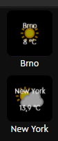

# Weather Widget for Loupedeck
Simple widget for showing weather info in a given location.

## Usage
1. Register on https://www.weatherapi.com/ (completely free) and obtain an API key from there.
1. In the Loupedeck software, go to `Weather Widget` profile plugins page and click `+` next to the `Weather Widget` folder.
1. In the field `Location` enter name of the location where you want to see the weather in and the API key you got from weatherapi.com, separated by `:` (semicolon). For example `New York:1268536251`.
1. Click on `Create`. Then you can drag the newly created action on your Loupedeck.

## Credits
* Made by Danol.
* Plugin icon from awesome [Icons8](https://icons8.com/).